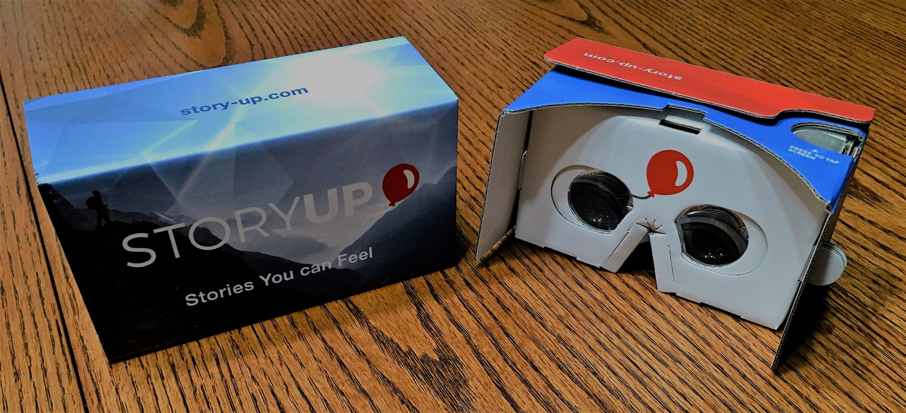

# StoryUP Tour
### by Stephen Sladek
##### October 10, 2018

&nbsp;&nbsp;&nbsp;&nbsp;&nbsp;&nbsp;I visited a startup in Columbia, MO called StoryUP. They are a Mixed Reality company that produces experiences utilizing EEG. When I walked up to the house, I wasn’t entirely sure what to expect. There was no sign out front, but being in the tech industry, I’m well aware that most great ideas are born out of a garage, so I take it all in stride. Sarah Hill, the CEO, greeted me and welcomed me into their studio. The inside looked much like an art gallery, there were photos hanging up that had been taken from places they have done work, and everything in the room appeared white and modern. I was greeted by two of the other employees and got to sneak a peek at one of the offices. Turns out that they use Unreal Engine 4 with the Blueprint Scripting system to quickly bring their virtual experiences to life. They also had to do some heavy modifying to the Muse SDK to get it to play nicely with UE4.

&nbsp;&nbsp;&nbsp;&nbsp;&nbsp;&nbsp;While I was there I got to try out two of their VR experiences including one for Google Cardboard that has you focus on a cocoon and watch butterflies hatch as your positivity rises above a certain threshold. I managed to hatch 23 within just a couple of minutes. The second one used Samsung Gear VR and lets you watch as a run down, graffitied and littered park becomes pristine and whole again. Both experiences make use of the Muse, an EEG headband that scans various channels of brain waves. StoryUP measures the Gamma Frontal Lobe Asymmetry for positivity, or more accurately, for openness. The measurements they gather are then used as an on/off switch when they pass a threshold to trigger when something happens in the application.
	
&nbsp;&nbsp;&nbsp;&nbsp;&nbsp;&nbsp;Sarah also let me try out a prototype of the Magic Leap AR headset, a contender to the Microsoft Hololens. They actually had quite an array of headsets, including the HTC Vive, the Oculus Rift and the new Vive Focus. Afterwards, we spent some time talking about how we became interested in VR, a summer program for VR at Mizzou, and the Computer Science Capstone program at SEMO. Sarah describes their experiences as, not a healthcare service, but more of a self-awareness application. Part of StoryUP’s mission is to help people become aware of their subconscious stress and be mindful about maintaining it.

&nbsp;&nbsp;&nbsp;&nbsp;&nbsp;&nbsp;The startup has been around since 2015 now and while they’re still looking for the market they would best fit into, they have done some contract work for other companies, building VR experiences for them. They have recently begun selling packages that come with an Oculus Go, Muse, and their Healium product. Healium gives access to their library of virtual experiences, with a new one slated to be released every six months.
	
&nbsp;&nbsp;&nbsp;&nbsp;&nbsp;&nbsp;It was exciting to get to visit a place that not only is working on cutting-edge technology, and experimenting on the frontier of the next big revolution in tech, but is actually located in the Midwest. I had a great time with them and am looking forward to seeing how they, and their products grow.
